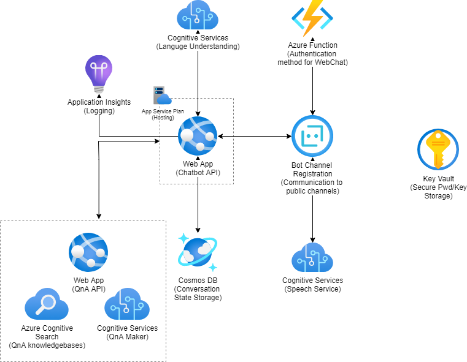

# BICEP templates for different AI solutions

## How to deploy via command line
First of all make sure you have the Azure CLI installed

Then follow following steps:
 - az login
 - az account set --subscription << SUBSCRIPTION NAME/ID >>
 - az deployment group create -f ./main.bicep -g << RESOURCE GROUP NAME >>

## Bot Project

Link to [Draw.IO](bot-project/bot-project.drawio)